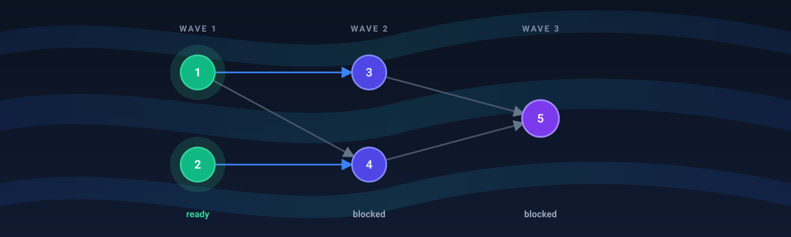
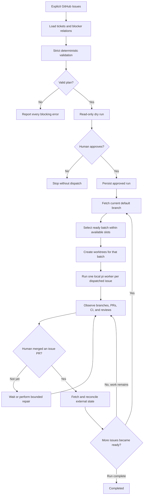
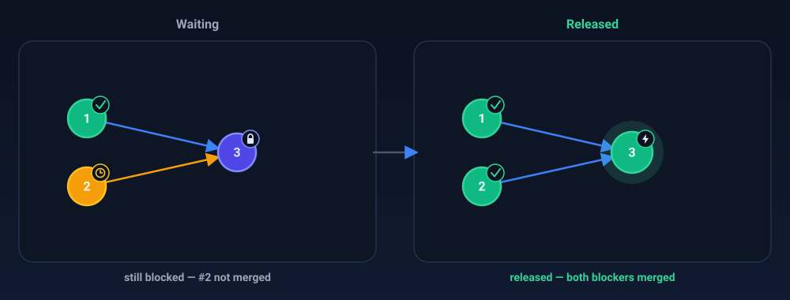
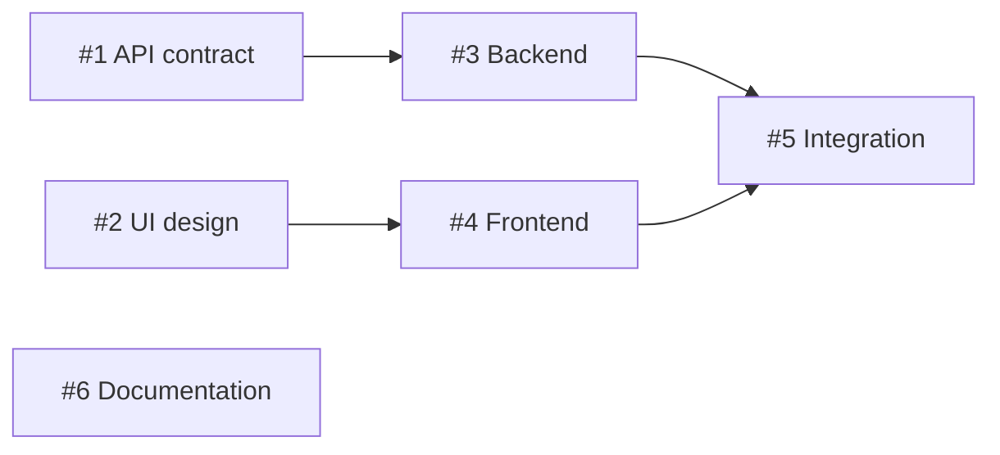
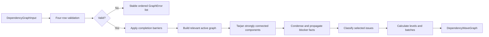

# pi-github-waves

<p align="center">
  
</p>

Dependency-driven GitHub Issue planning for [pi](https://github.com/earendil-works/pi): validate explicit work, calculate safe parallelism, and preview the result before any execution system exists.

> [!IMPORTANT]
> **Project status: early development.** The pure graph core and the read-only `/waves plan` vertical slice are implemented and tested. Durable runs, worktrees, workers, PR monitoring, repair orchestration, web UI, and macOS code are **not available yet**.

## Why this exists

Agent parallelism should be determined by dependencies, not by how many tickets happen to exist.

If issues `#1` and `#2` have no blockers, both can run concurrently. If `#3` depends on both, it must wait. An unrelated issue `#4` should not wait for `#3` merely because they appear in the same project. The dependency graph—not a global phase barrier—decides what is ready.

`pi-github-waves` is designed around five principles:

1. **GitHub Issues are the source of truth.**
2. **Dependencies are explicit.** The system never guesses edges from titles or prose.
3. **Planning is deterministic and read-only.** It never writes to GitHub, fetches refs, or changes the working tree. Merge verification uses GitHub's read-only commit-comparison API.
4. **Workers are isolated.** Each dispatched issue gets its own branch, worktree, agent, and reviewable PR.
5. **Merge stays human.** Automation may implement, monitor, and perform bounded repairs, but it never merges.

## Inspiration

This project was inspired by [Gabriel Packer (@gkpacker)](https://x.com/gkpacker) and his post about orchestrating AI-agent work as dependency-driven **waves**:

- [“Meu workflow com IA como solo founder, parte 2”](https://x.com/gkpacker/status/2080306086653894733)

Gabriel described an orchestrator that reads explicit ticket relationships, builds a dependency graph, starts independent work in parallel worktrees, watches PRs and CI, and releases the next work as blockers are merged. `pi-github-waves` adapts that idea to GitHub Issues and pi. This is an independent project; the credit does not imply affiliation or endorsement.

## Project status

| Capability | Status |
|---|---|
| Pure dependency-graph validation and planning | **Available** |
| Completion barriers and relevant-cycle detection | **Available** |
| Deterministic dispositions, levels, and batches | **Available** |
| GitHub Issue loading and strict ticket parsing | **Available** |
| Native dependency traversal and verified completion | **Available** |
| `/waves plan` textual TUI report | **Available** |
| Plan approval and execution | Planned |
| Worktree and local pi worker dispatch | Planned |
| Persistent runs and explicit resume | Planned |
| PR, CI, and review reconciliation | Planned |
| Bounded repair workers | Planned |

The current package manifest is version `0.0.0` with `private: true`. Work from a repository checkout; the README does not assume registry availability.

## The complete intended workflow

The final system will accept an explicit issue set such as `#3 #4 #6`. It will recursively inspect explicit blockers, validate selected open work, show a dry run, and wait for approval. Only then will it select ready issues up to the configured concurrency limit, create isolated worktrees, and dispatch locally running pi workers.



### Why each new batch starts from the default branch

A downstream branch should not be based on an unmerged sibling branch. Before every dispatch cycle, the orchestrator will fetch the repository’s discovered default branch, select a ready batch no larger than the available concurrency slots, and create that batch’s worktrees from the same current remote tip. Ready issues beyond the limit wait for a later slot. This reduces avoidable conflicts and ensures CI tests the same history that can reach production.

### Waves are not runtime barriers

Topological levels are useful for explaining a plan, but scheduling is dependency-by-dependency. An issue is released the moment every one of its **own** blockers is merged — not when an arbitrary phase completes:

<p align="center">
  
</p>

Consider this graph, where arrows mean **blocks**:



A display plan might show:

- **Level 1:** `#1`, `#2`, `#6`
- **Level 2:** `#3`, `#4`
- **Level 3:** `#5`

At runtime, `#3` may start as soon as `#1` is merged; it does not wait for `#2` or `#6`. Likewise, a slow `#4` does not block unrelated work. Only `#5` waits for both of its own blockers.

## Available today: `/waves plan`

The bundled pi extension connects the graph core to a trusted GitHub.com worktree through read-only `git` and `gh` subprocesses. It accepts 1–50 unique Issue numbers, recursively loads up to 200 same-repository boundary blockers from GitHub's native dependency API, verifies completed blockers, and appends one durable textual session entry.

### Requirements and local use

- Node.js 22.19 or newer;
- pnpm;
- pi 0.84.x;
- GitHub CLI authenticated for `github.com`;
- a trusted worktree with exactly one supported GitHub.com `origin` fetch URL.

```bash
git clone https://github.com/lscborges1/pi-github-waves.git
cd pi-github-waves
pnpm install --frozen-lockfile
pnpm build
gh auth status --hostname github.com
pi -e .
```

`pi -e .` loads the package for the current invocation without installing it persistently. From the pi TUI, run:

```text
/waves plan #3 #4 #6
```

The report shows repository identity and default tip, selected and boundary Issues, completion evidence, native edges, dispositions, relevant cycles, levels/batches, and ordered diagnostics. It is capped at 50 KiB and 2,000 lines and always ends with `No execution occurred.`

### Ticket and dependency contract

Every open selected Issue must carry `agent: suitable`, must not carry `agent: not suitable` or `agent: review required`, and must contain exactly one accepted English or Portuguese level-two heading for each section:

| English | Portuguese |
|---|---|
| Context | Contexto |
| Objective | Objetivo |
| Scope | Escopo |
| Out of scope | Fora de escopo |
| Expected behavior | Comportamento esperado |
| Technical notes | Detalhes técnicos |
| Acceptance criteria | Critérios de aceite |
| Test scenarios | Cenários de teste |

Acceptance criteria and test scenarios require Markdown list items. Bodies are limited to 128 KiB. Add blocker edges with GitHub's native **Dependencies → Blocked by** relationship; prose declarations are never interpreted as graph edges.

A closed Issue counts as complete only when its current closure epoch contains a merged PR targeting the repository's current default branch and that PR's merge OID is identical to or ancestral to the current default tip. Verified completion is a traversal barrier.

Planning performs no fetch, configuration lookup, fingerprinting, persistence, approval, dispatch, GitHub mutation, ref mutation, or temporary-file output.

## Available today: the dependency-wave graph

The implemented `./graph` module is the deterministic core that later adapters and commands will call. It:

- accepts normalized, trusted TypeScript values;
- validates graph-level invariants and returns stable errors;
- treats completed nodes as dependency barriers;
- finds cycles only in the relevant active graph;
- propagates invalid selected work and unresolved external blockers;
- classifies every selected issue;
- calculates deterministic display levels and concurrency batches;
- never mutates caller-owned values;
- performs no filesystem, process, Git, GitHub, network, or pi I/O;
- has no runtime dependencies.



### API example

Edges point from `blockerId` to `blockedId`. This example describes a diamond: `#1` unlocks `#2` and `#3`, then `#4` waits for both branches to converge.

```ts
import {
  buildDependencyWaveGraph,
  type DependencyGraphInput,
} from "pi-github-waves/graph";

const input: DependencyGraphInput = {
  schemaVersion: 1,
  maxConcurrency: 2,
  selectedIds: ["issue-4", "issue-2", "issue-1", "issue-3"],
  nodes: [
    { id: "issue-1", issueNumber: 1, status: "eligible" },
    { id: "issue-2", issueNumber: 2, status: "eligible" },
    { id: "issue-3", issueNumber: 3, status: "eligible" },
    { id: "issue-4", issueNumber: 4, status: "eligible" },
  ],
  edges: [
    { blockerId: "issue-1", blockedId: "issue-2" },
    { blockerId: "issue-1", blockedId: "issue-3" },
    { blockerId: "issue-2", blockedId: "issue-4" },
    { blockerId: "issue-3", blockedId: "issue-4" },
  ],
};

const outcome = buildDependencyWaveGraph(input);

if (outcome.kind === "invalid_input") {
  console.error(outcome.errors);
} else {
  const summary = {
    runnable: outcome.graph.runnable,
    selected: outcome.graph.selected.map(
      ({ issueNumber, disposition, level }) => ({
        issueNumber,
        disposition,
        level,
      }),
    ),
    levels: outcome.graph.levels,
  };

  console.log(summary);
}
```

Key output:

```ts
{
  runnable: true,
  selected: [
    { issueNumber: 1, disposition: "ready", level: 1 },
    { issueNumber: 2, disposition: "blocked_selected", level: 2 },
    { issueNumber: 3, disposition: "blocked_selected", level: 2 },
    { issueNumber: 4, disposition: "blocked_selected", level: 3 },
  ],
  levels: [
    { level: 1, batches: [[1]] },
    { level: 2, batches: [[2, 3]] },
    { level: 3, batches: [[4]] },
  ],
}
```

The actual selected entries also contain `id`, `directBlockerNumbers`, and `unresolvedBlockerNumbers`. The graph output additionally contains all boundary nodes, normalized explanatory edges, and relevant cycles.

## Graph model

### Inputs

```ts
interface DependencyGraphInput {
  schemaVersion: number;
  maxConcurrency: number;
  selectedIds: string[];
  nodes: DependencyNode[];
  edges: DependencyEdge[];
}
```

- `selectedIds` is the exact requested planning set. Entries already marked `complete` remain in the result but are not future execution work.
- Nodes outside that set are **boundary blockers**. They provide dependency context but are never dispatched.
- `blockerId -> blockedId` is the edge direction.
- The caller supplies the complete incoming blocker closure for selected work.
- IDs are opaque strings. Valid IDs are never trimmed, case-folded, or Unicode-normalized.

### Node statuses

| Status | Role | Meaning |
|---|---|---|
| `eligible` | Selected | Upstream ticket and label validation passed |
| `invalid` | Selected | The selected issue cannot execute |
| `complete` | Selected or boundary | Merge completion was already verified upstream |
| `unresolved` | Boundary | External work is not verified complete |

Selected nodes may be `eligible`, `invalid`, or `complete`. Boundary nodes may be `unresolved` or `complete`. Other role/status combinations are validation errors.

### Selected dispositions

Classification uses strict first-match precedence:

| Disposition | Meaning |
|---|---|
| `invalid` | The selected issue is invalid or affected by a relevant cycle |
| `completed_preexisting` | The selected issue was already verified complete |
| `blocked_invalid_selected` | Its active blocker closure contains invalid selected work |
| `blocked_external` | Its active blocker closure contains an unresolved boundary blocker |
| `ready` | It has no incomplete selected direct blocker |
| `blocked_selected` | It waits only for selected issues in this graph |

Invalid selected work takes precedence over external blocking. External blocking takes precedence over ordinary selected blocking.

Every selected output includes:

- `directBlockerNumbers`: all direct blockers, including completed or irrelevant blockers;
- `unresolvedBlockerNumbers`: disposition-specific non-complete direct blockers reported for explanation—for an independently `invalid` node, this includes all non-complete direct blockers even though they did not cause the invalid status;
- `level`: a display level for `ready` and `blocked_selected` work, otherwise `null`.

### Validation

Validation is deterministic and runs in four ordered rows. If one row emits errors, later rows do not run, but all errors in the current row are collected.

1. **Scalars and limits** — schema version, concurrency, IDs, issue numbers, and graph size.
2. **Identity and roles** — duplicate identities, selected resolution, and allowed statuses.
3. **Edges** — missing endpoints, self-dependencies, and duplicate edges.
4. **Closure** — every boundary node must be in the incoming closure of selected work.

Current limits:

| Limit | Value |
|---|---:|
| Unique selected nodes | 50 |
| Boundary nodes | 200 |
| Input edges | 10,000 |
| Concurrency | 1–8 |

Invalid input returns:

```ts
{
  kind: "invalid_input",
  errors: GraphError[],
}
```

Errors have stable cardinality, attribution, details, and Unicode code-point ordering. No partial graph is returned.

### Completion barriers

Completion is more than another status. It cuts off traversal.

Suppose `#3` depends on completed `#2`, and `#2` once depended on unresolved `#1`: `#1 unresolved → #2 complete → #3 selected`.

`#3` does not inherit the old unresolved state or cycles upstream of `#2`. The merge represented by `#2` is the barrier: its already-integrated result is what matters to new work.

The planner still retains all input edges in the output for explanation. It excludes completed nodes and edges incident to them only from the active graph used for cycle detection and blocker propagation.

### Relevant cycles

Tarjan’s strongly connected components algorithm runs only on the relevant active graph. A cycle:

- containing selected work is reported;
- among boundary blockers leading into selected work is reported;
- propagates invalidity to selected dependents;
- hidden upstream of a completed blocker is ignored;
- in a disconnected, irrelevant part of the input cannot affect planning.

### Levels and batches

Only `ready` and `blocked_selected` nodes appear in levels.

- Levels begin at 1 and are consecutive.
- Issue numbers inside a level are ascending.
- Each level is partitioned into consecutive batches no larger than `maxConcurrency`.
- Batches describe estimated parallelism; they are not runtime synchronization barriers.

### When a graph is runnable

`runnable` is true exactly when:

- there are no relevant cycles;
- no selected node is `invalid`, `blocked_invalid_selected`, or `blocked_external`; and
- at least one selected node exists.

A selection containing only `completed_preexisting` work is runnable with empty levels. An empty graph is structurally valid but non-runnable.

### Determinism, complexity, and ownership

Input array order does not affect output. Nodes, edges, adjacency, errors, cycles, blocker numbers, levels, and batches all use explicit stable ordering rules. Property tests permute the same graph and require deep-equal outcomes.

After deterministic normalization and sorting, graph processing is `O(V + E)`. Relevant discovery, Tarjan SCC detection, condensation, propagation, classification, and level construction use bounded linear passes rather than one traversal per selected issue.

The function copies before sorting and never mutates input arrays or objects. Tests call it with deeply frozen values.

## Planned orchestration

The graph planner is intentionally independent from the systems that will feed and execute it. Planned layers are:

- **domain** — issue specifications, graphs, readiness, fingerprints, and state transitions;
- **application** — plan, run, resume, and status use cases with idempotency rules;
- **GitHub adapter** — issues, dependencies, closing PRs, checks, and reviews via `gh`;
- **Git adapter** — repository discovery, refs, branches, commits, and worktrees;
- **workers** — local pi subprocess lifecycle and structured event capture;
- **repairs** — bounded CI/review repair over normalized, scoped findings;
- **persistence** — approved plans, append-only events, snapshots, and run locks;
- **extension and skill** — `/waves` commands plus operator guidance.

### Ticket contract

The implemented preflight requires every selected Issue and recursively discovered blocker to be readable. A selected Issue already verified as completed is exempt from body and label validation because it will never be dispatched. Every other selected Issue must be open and satisfy the label and eight-section contract documented above. Malformed executable tickets remain visible as `invalid` and make the plan non-runnable.

Native GitHub dependency relations are the sole edge source. No body fallback or LLM inference is used.

### Planning and future approval

The implemented `/waves plan #3 #4 #6` command reads and validates without GitHub, ref, or working-tree mutation. It has no configuration, fingerprint, approval, or run state.

A future execution slice will need to persist an approved snapshot, revalidate external state, and require explicit confirmation before dispatch. `/waves run` does not exist today.

### Workers and worktrees

Each ready issue will receive:

- a local worktree created from the current remote default-branch tip;
- an owned `agent/issue-<number>-<slug>` branch;
- one local pi worker constrained to the issue snapshot and tool policy;
- one PR targeting the discovered default branch.

Worker prose will not be authoritative. Completion will be reconciled from process exit, remote branch identity, PR head/base, issue linkage, merge metadata, and Git reachability.

### CI, review, and repair

CI logs and review comments are untrusted data. Planned read-only triage will normalize one finding at a time and reject malformed, stale, out-of-scope, ambiguous, or command-like requests. Accepted repairs will be serialized per issue and bounded by separate CI and review attempt limits.

A changed PR head makes old findings stale. Exhausted limits or ambiguous state move the issue to `needs_attention` rather than allowing unsafe automation.

### Persistence and resume

Runs will live under `~/.pi/agent/state/github-waves/<owner>/<repo>/<run-id>/`. An append-only write-ahead journal and idempotency keys will record side-effect intent before execution and the observed external result afterward.

`/waves resume <run-id>` will acquire an OS-backed lock, query GitHub and Git, reconcile persisted evidence against external truth, and continue only safe transitions. Repeating reconciliation against unchanged external state should produce no duplicate workers, branches, or PRs.

## Safety boundaries

The implemented planner and intended system fail closed:

- no GitHub, Git ref, or working-tree mutation during planning, including no fetch;
- no execution without the `agent: suitable` label;
- no inferred dependency edges;
- no dispatch when validation, repository identity, auth, or ownership is ambiguous;
- no shell interpolation for GitHub, Git, or pi process arguments;
- no direct execution of reviewer-provided prompts or commands;
- no release of downstream work until merge and default-branch reachability are verified;
- no automatic merge path;
- no automatic destructive cleanup in the first version.

The public graph module is narrower still: it is pure computation with no I/O capability. Planning ports and `PlanResultV1` remain internal until a genuine headless client exists.

## Roadmap

The dependency-wave graph foundation and safe planner are implemented: stable contracts, validation, native dependency traversal, completion barriers, relevant SCCs, propagation, classification, levels, bounded TUI rendering, and tests. The delivery slices are:

1. **Safe planner — implemented**
   Current pi package, read-only Git/GitHub access, strict Issue parser, native dependencies, zero-fetch completion verification, and `/waves plan`.
2. **One-issue tracer**
   Approval, journal, lock, one worktree, one pi worker, PR reconciliation, and `/waves status`.
3. **Resumable graph**
   Concurrent dependency scheduling, human-merge reconciliation, crash recovery, and downstream release from a fresh remote tip.
4. **Bounded repair**
   Normalized CI/review findings, read-only triage, serialized repair workers, stale-finding handling, and attempt limits.
5. **Hardening**
   Recovery-matrix coverage, ownership collision tests, output bounds, documentation, and end-to-end validation.

A web dashboard remains deferred until durable journal, snapshot, and status data provide a stable read model. A read-only SwiftUI menu-bar companion may follow that model later; macOS approvals or execution stay deferred until a stable audited local protocol exists.

Each slice must remain demonstrable through public behavior and extend the same deterministic state model.

## Development

Tooling:

- Node.js 22.19 or newer is required.
- Use pnpm for dependency management and project scripts.

Commands:

```bash
pnpm install --frozen-lockfile
pnpm test
pnpm test:watch
pnpm typecheck
pnpm build
pnpm pack --dry-run
```

Current layout:

```text
src/graph/      Public graph contracts and implementation
src/planning/   Internal command, ticket, traversal, diagnostics, and safety contracts
src/adapters/   Read-only subprocess, Git, and GitHub adapters
src/presentation/ Bounded deterministic textual report
extensions/     Bundled pi extension
skills/         Bundled operating skill
test/           Unit, contract, integration, property, and complexity tests
docs/           Architecture, specifications, and implementation plans
dist/           Generated ESM JavaScript and declarations
```

The public package surface is `pi-github-waves/graph`. Validation, relevant-graph construction, SCC, and propagation helpers are internal implementation seams and are intentionally absent from the package export map.

## Contributing

Issues and pull requests are welcome, especially when they preserve the project’s deterministic, fail-closed boundaries and keep implemented functionality clearly separated from roadmap functionality.

## License

Licensed under the [Apache License, Version 2.0](LICENSE). Contributions are
accepted under the same license; see the license header for the applicable
patent grant and trademark disclaimer.
